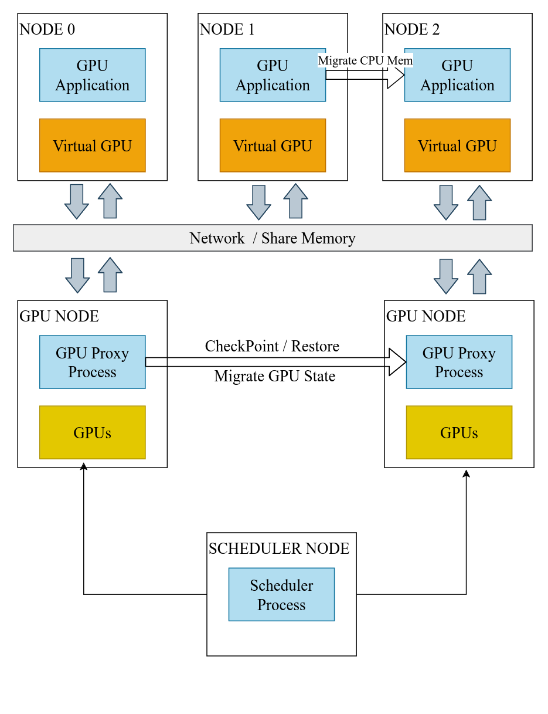
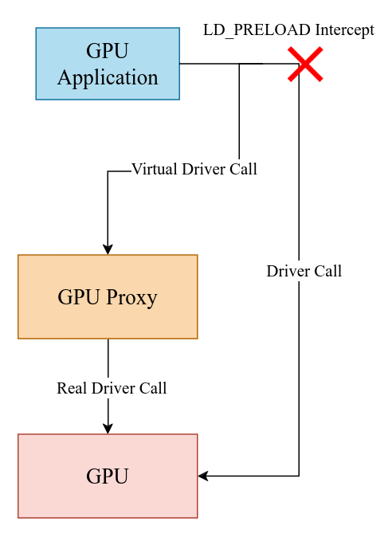

# GPU-Checkpoint


目标是实现一个高效的、支持异构的GPU Checkpoint系统，支持对GPU进程进行保存checkpoint,恢复checkpoint,同时支持对GPU进程进行在线迁移。

- **Checkpoint/Restore**：对GPU进程checkpoint，实现save checkpoint和restore checkpoint.
- **Heterogeneous** ：异构是指支持不同架构的GPU checkpoint,分别恢复到相同架构GPU上，而非把一个进程恢复到异构GPU上.
- **Live Migration**：在线迁移，把GPU任务迁移到其他的GPU上，应该尽可能达到不停机的效果，checkpoint和compute时间的overlap.
- **Schedule**：实现GPU进程调度，优化GPU资源的利用率


## Design

### Architecture




### GPU-Proxy


## Roadmap

### 第一阶段

在Nvidia GPU上实现基本功能

- [ ] GPU proxy
- [ ] 劫持常用api,能够运行常见GPU程序
- [ ] Checkpoint& Restore
  


## Usage

编译
```bash
git clone https://github.com/chiiydd/gpu-checkpoint.git
cd gpu-checkpoint
cmake -B build 
cd build 
make
```
会在`build`目录下生成`libhijacker.so`文件,以及`build/bin`目录下生成 `gpu-proxy`和`test`文件。

目前的测试环境：

|  Driver Version | CUDA Version|
|---|---|
|550.107.02   |  12.4     |

测试
```bash
#启动 gpu-proxy
cd build
make proxy-start

#在另外一个终端
cd build 
make proxy-test

```


测试

```bash
#在build目录下
make hook-test
```

或者在运行程序时设置`LD_PRELOAD`环境变量，例如

```bash
LD_PRELOAD=/workspace/gpu-checkpoint/build/libhijacker.so  ./cuda-app
```